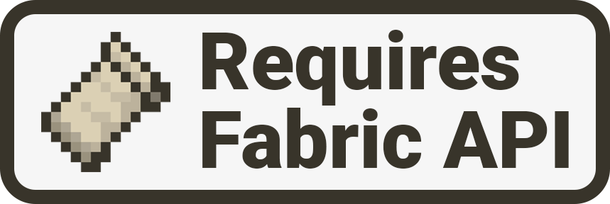

# 关于模组

​     

## 📖 关于本模组

**舒适空岛（Comfy Sky）**是一个能帮助玩家更容易度过李芒果空岛前期的模组。所有添加的元素，包括修改原版中的特性让玩家能在不破坏李芒果空岛体验的同时，大幅度降低了前期的吃苦（坐牢）程度。这个模组意在优化原版的随机机制，使玩家不用重复大量机械式的操作或是长时间挂机。

​     

## 📖 声明

WZSSOFT制作的所有模组完全免费。

目前公开的下载源仅有CurseForge和Modrinth，其余下载源均为非官方正式版本。

**舒适空岛（Comfy Sky）**是完全免费的项目，未来也不会进行任何的收费。

**舒适空岛（Comfy Sky）**没有爱发电等赞助渠道。

**舒适空岛（Comfy Sky）**不会上架我的世界中国版。

**舒适空岛（Comfy Sky）**保证内容绝对纯净，不包含任何获取用户信息的代码。

**舒适空岛（Comfy Sky）**所有版本支持向上升级。

