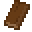

# 可疑的草方块

​     

| 添加此物品的原因 | 获取古物碎片                    |
| :--------------- | :------------------------------ |
| 稀有度           | 常见                            |
| 命名空间         | comfysky:suspicious_grass_block |
| 添加版本         | 17.1.3                          |

​     

## 生成

### 被动生成

当被挖掘过的草方块转化为草方块时，在挖掘点周围（不含挖掘点）8格曼哈顿距离之内随机生成一个可疑的草方块，其生成概率为80分之一

​     

## 获取

生存模式无法获取

​     

## 用途

​     

## 交互

1.使用任意等级的挖掘铲挖掘可疑的草方块有概率获得以下物品

战利品表适用于**舒适空岛版本:17.1.15**

| 物品                                                         | 概率  |
| ------------------------------------------------------------ | ----- |
| 机械放置器1号碎片 | 1/32  |
| 机械放置器2号碎片 | 1/32  |
| 机械放置器3号碎片 | 1/32  |
| 青瓷瓶1号碎片 | 1/32  |
| 青瓷瓶2号碎片 | 1/32  |
| 青瓷瓶3号碎片 | 1/32  |
| 古代中国编钟1号碎片 | 1/32  |
| 古代中国编钟2号碎片 | 1/32  |
| 古代中国编钟3号碎片 | 1/32  |
| 破损的古罗马玻璃盘1号碎片 | 1/32  |
| 定向传送门1号碎片 | 1/32  |
| 定向传送门2号碎片 | 1/32  |
| 定向传送门3号碎片 | 1/32  |
| 定向传送门4号碎片 | 1/32  |
| 花肥桶1号碎片 | 1/32  |
| 花肥桶2号碎片 | 1/32  |
| 印花地毯1号碎片 | 1/32  |
| 可疑的草方块补充包 | 15/32 |

​     

## 数值表     

<table border=1> <tr> <th align=left colspan=3> 标签 </th> </tr> <tr> <td align=center rowspan=4 width=120; style="vertical-align:middle"> 方块标签 </td> <td> #comfysky:zoetic_grass_can_spread </td> </tr> <tr> <td> #minecraft:dirt </td> </tr> <tr> <td> #minecraft:mineable/shovel </td> </tr> <tr> <td> #comfysky:digging_shovel </td> </tr> </table>

​     

## 历史

<table border=1 style="width:100% ;height:100%"> <tr> <th align=center colspan=3>Java版</th> </tr> <tr> <td align=center rowspan=1 width=120; style="vertical-align:middle">1.19.4</td> <td width=120;>17.1.3</td> <td>加入了可疑的草方块</td> </tr> </table>

​     

## 你知道吗

​     

## 参考

​     

