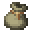
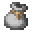

# 古物研究学家

​     

| 添加此村民职业的原因 | 增加玩家获取大量古物碎片的一种途径 |
| :------------------- | :--------------------------------- |
| 命名空间             | comfysky:antiquarian               |
| 添加版本             | 17.1.12                            |

​     

## 工作站

组装台（comfysky:assembly_station）

​     

## 交易

| 交易等级 | 出售                                                 | 购买                                                         | 最大购买数量 | 获取经验 | 价格浮动 |
| -------- | ---------------------------------------------------- | ------------------------------------------------------------ | ------------ | -------- | -------- |
| 1        | X 20 | X 1 | 5            | 2        | 0.05F    |
| 1        | X 20 | X 1 | 5            | 2        | 0.05F    |
| 1        | X 20 | X 1 | 5            | 2        | 0.05F    |
| 1        | X 20 | X 1 | 5            | 2        | 0.05F    |
| 1        | X 20 | X 1 | 5            | 2        | 0.05F    |

​     

## 历史

<table border=1 style="width:100% ;height:100%"> <tr> <th align=center colspan=3>Java版</th> </tr> <tr> <td align=center rowspan=1 width=120; style="vertical-align:middle">1.20.1</td> <td width=120;>17.1.12</td> <td>加入了村民职业古物研究学家</td> </tr></table>

​     

## 你知道吗

​     

## 参考

​     

