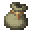
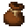
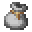

# 古物研究学家

​     

| 添加此村民职业的原因 | 增加玩家获取大量古物碎片的一种途径 |
| :------------------- | :--------------------------------- |
| 命名空间             | comfysky:antiquarian               |
| 添加版本             | 17.1.12                            |

​     

## 工作站

组装台（comfysky:assembly_station）

​     

## 交易

当前交易版本：1.20.1-17.1.15+

|       | 交易次序 | 概率  | 收购                                                         | 出售                                                         | 经验值 | 交易次数 | 价格浮动 |
| ----- | -------- | ----- | ------------------------------------------------------------ | ------------------------------------------------------------ | ------ | -------- | -------- |
| 新手1 | 1&2      | 100%  | 任意陶片X1 | X1           | 5      | 12       | 0.05F    |
| 学徒2 | 3&4      | 66.6% | 瓶子草种子X1 | X1           | 5      | 12       | 0.05F    |
|       | 3&4      | 66.6% | 火把花种子X1 | X1           | 5      | 12       | 0.05F    |
|       | 3&4      | 66.6% | 不死图腾X1 | X1           | 10     | 12       | 0.05F    |
| 老手3 | 5        | 100%  | 14–58+书X1 | 干燥的附魔书X1 | 10     | 12       | 0.2F     |
|       | 6        | 100%  | 14–58+书X1 | 范围缩小附魔书X1 | 10     | 12       | 0.2F     |
| 专家4 | 7&8      | 100%  | 任意古物碎片X1 | X2           | 15     | 12       | 0.05F    |
| 大师5 | 9&10     | 40%   | X 20+ X 5 | 草方块捆绑包 X 1 | 30     | 3        | 0.2F     |
|       | 9&10     | 40%   | X 20+ X 5 | 沙子捆绑包 X 1 | 30     | 3        | 0.2F     |
|       | 9&10     | 40%   | X 20+ X 5 | 红沙捆绑包 X 1 | 30     | 3        | 0.2F     |
|       | 9&10     | 40%   | X 20+  X 5 | 雪块捆绑包 X 1 | 30     | 3        | 0.2F     |
|       | 9&10     | 40%   | X 20+ X 5 | 沼泽捆绑包 X 1 | 30     | 3        | 0.2F     |

​     

## 历史

<table border=1 style="width:100% ;height:100%"> <tr> <th align=center colspan=3>Java版</th> </tr> <tr> <td align=center rowspan=2 width=120; style="vertical-align:middle">1.20.1</td> <td width=120;>17.1.12</td> <td>加入了村民职业古物研究学家</td> </tr> <tr> <td align=left rowspan=1 width=120; style="vertical-align:middle">17.1.15</td> <td>古物研究学家交易内容进行了平衡性修改和补充</td> </tr></table>

​     

## 你知道吗

​     

## 参考

​     

