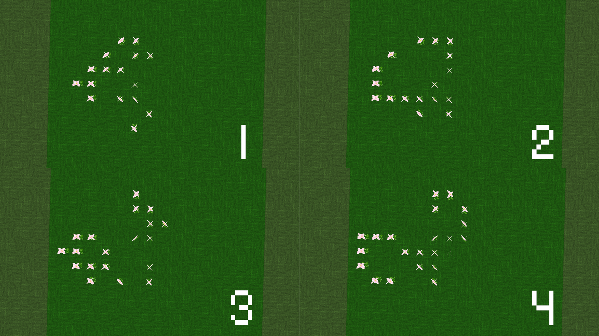

# 康威生命游戏

添加版本：v17.0.13

鲜活草地每20tick进行一次判断是否需要长出生命花或是上方生命花死亡

在舒适空岛中的设定是time of day 大于 12000时，玩家可以自由编辑生命花的组合形状

可以把生命花种植在鲜活草地上来模拟康威生命游戏

[康威生命游戏 - 维基百科，自由的百科全书 (wikipedia.org)](https://zh.wikipedia.org/wiki/康威生命游戏)