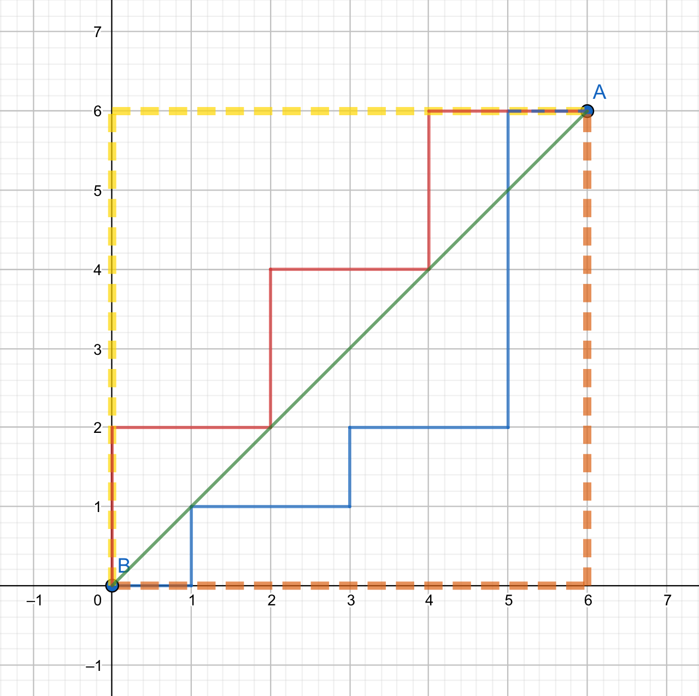

# 可疑的方块生成

添加版本：v17.1.9

为了防止歧义，本篇中所有出现的可疑方块的均是舒适空岛模组加入的方块，与原版可疑的方块无关

模组中加入的可疑方块表面均有明显的贴图以和原版中的可疑方块区分

​     

## 可疑的方块生成（被动生成）

当被挖掘过的方块转化为原来的方块时，在挖掘点周围（不含挖掘点）8格曼哈顿距离*之内随机生成一个可疑的方块，其生成概率为80分之1（即1.25%）

​     

曼哈顿距离*：如下图所示点A到点B有橙色，红色，蓝色，黄色4条路径，无论选择哪条路径其曼哈顿距离均为12

此特性无法使用指令关闭

​     

## 参考

[曼哈顿距离 - 维基百科，自由的百科全书 (wikipedia.org)](https://zh.wikipedia.org/wiki/曼哈頓距離)
