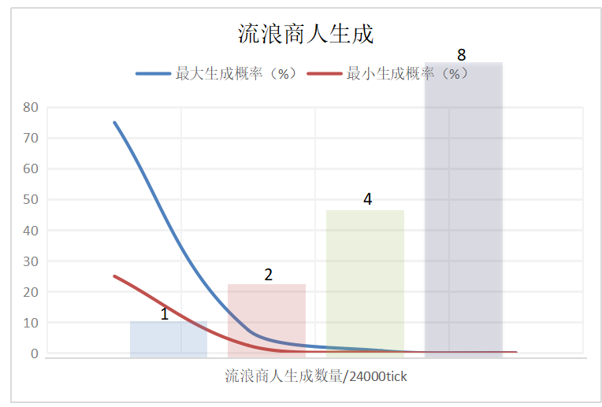

# 流浪商人成群结队生成

加载此模组会自动替换Minecraft流浪商人生成算法。

添加版本：v17.0.9

（图：x轴-1000以内的随机数， y轴-生成流浪商人的数量）

原版流浪商人每24000tick有25%，50%，75% * 10%生成几率（即最大生成可能性为7.5%每24000tick）

修改过后的流浪商人生成概率

| 等级 | 概率               | 最大生成概率 | 生成流浪商人数量（每24000tick） |
| ---- | ------------------ | ------------ | ------------------------------- |
| 0    | 25%,50%,75%        | 不适用       | 0                               |
| 1    | 25%,50%,75% * 100% | 75%          | 1                               |
| 2    | 25%,50%,75% * 10%  | 7.5%         | 2                               |
| 3    | 25%,50%,75% * 1%   | 0.75%        | 4                               |
| 4    | 25%,50%,75% * 0.1% | 0.075%       | 8                               |

使用指令 /gamerule doTraderSpawning false 来关闭流浪商人的生成（默认为true）

​     

