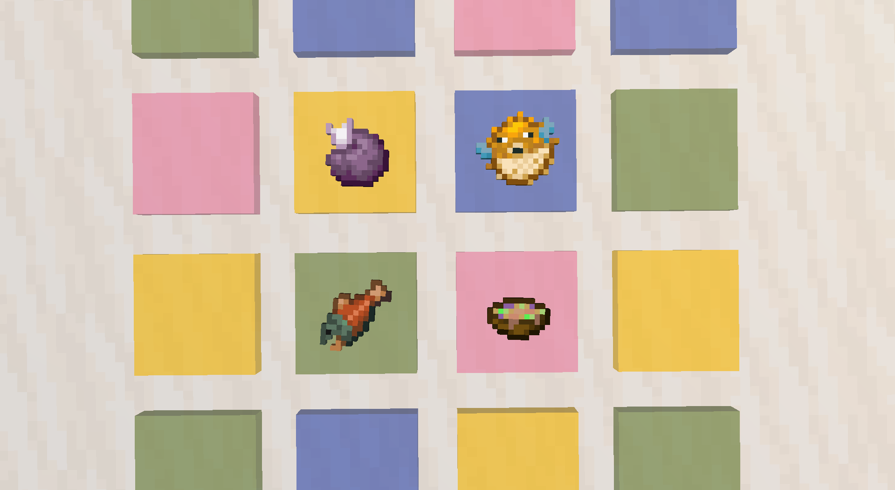

# 古罗马玻璃盘

## 蓝宝石色古罗马玻璃盘

​     

| 添加此物品的原因 | Minecraft没有可以展示食物的容器                  |
| :--------------- | :----------------------------------------------- |
| 稀有度           | 罕见                                             |
| 命名空间         | comfysky:sapphire_blue_ancient_roman_glass_plate |
| 添加版本         | 17.1.9                                           |

​     

## 玫瑰粉色古罗马玻璃盘

​     

| 添加此物品的原因 | Minecraft没有可以展示食物的容器              |
| :--------------- | :------------------------------------------- |
| 稀有度           | 罕见                                         |
| 命名空间         | comfysky:rose_pink_ancient_roman_glass_plate |
| 添加版本         | 17.1.9                                       |

​     

## 祖母绿色古罗马玻璃盘

​     

| 添加此物品的原因 | Minecraft没有可以展示食物的容器                  |
| :--------------- | :----------------------------------------------- |
| 稀有度           | 罕见                                             |
| 命名空间         | comfysky:emerald_green_ancient_roman_glass_plate |
| 添加版本         | 17.1.9                                           |

​     

## 琥珀色古罗马玻璃盘

​     

| 添加此物品的原因 | Minecraft没有可以展示食物的容器          |
| :--------------- | :--------------------------------------- |
| 稀有度           | 罕见                                     |
| 命名空间         | comfysky:amber_ancient_roman_glass_plate |
| 添加版本         | 17.1.9                                   |

​     

## 获取

1.使用任意等级的挖掘铲挖掘可疑的草方块有概率获取破损的古罗马盘子，详细查看**可疑的草方块-交互**

2.组装台使用破损的古罗马盘子修复

​     

## 用途

### 装饰方块

古罗马玻璃盘中可以放置任意1个物品，并可以在水平任意角度放置它

​     

### 食用食物

当盘子中放置的物品是食物时，右键盘子可以吃掉它

​     

## 交互

1.当前物品是破损状态时，右键组装台将碎片进行修复，详细查看**组装台-交互**，此时该物品无法放置

2.当前物品是修复状态时，右键可以放置在完整方块的上表面

3.手持任意物品右键该方块，将物品放置在盘子中

4.潜行+右键取出盘子中的物品

5.当盘子中的物品是食物时，右键食用盘子中的物品

6.使用非精准采集的工具破坏盘子时，盘子会变为破损状态

​     

## 数值表

<table border=1> <tr> <th align=left colspan=3> 标签 </th> </tr> <tr> <td align=center rowspan=1 width=120; style="vertical-align:middle"> 方块标签 </td> <td> #minecraft:mineable/pickaxe </td> </tr> <tr> <td align=center rowspan=1 width=120; style="vertical-align:middle"> NBT标签 </td> <td> #Broken </td> </tr> </table>

​     

## 历史

<table border=1 style="width:100% ;height:100%"> <tr> <th align=center colspan=3>Java版</th> </tr> <tr> <td align=center rowspan=5 width=120; style="vertical-align:middle">1.19.4</td> <td align=center rowspan=5 width=120; style="vertical-align:middle">17.1.9</td> <td>加入了蓝宝石色古罗马玻璃盘</td> </tr> <tr> <td>加入了玫瑰粉色古罗马玻璃盘</td> </tr> <tr> <td>加入了祖母绿色古罗马玻璃盘</td> </tr> <tr> <td>加入了琥珀色古罗马玻璃盘</td> </tr> </table>

​     

## 你知道吗

1.使用创造模式指令获取的古罗马玻璃盘不带有NBT不能进行修复或者放置

​     

## 参考

https://en.wikipedia.org/wiki/Roman_glass

​     

