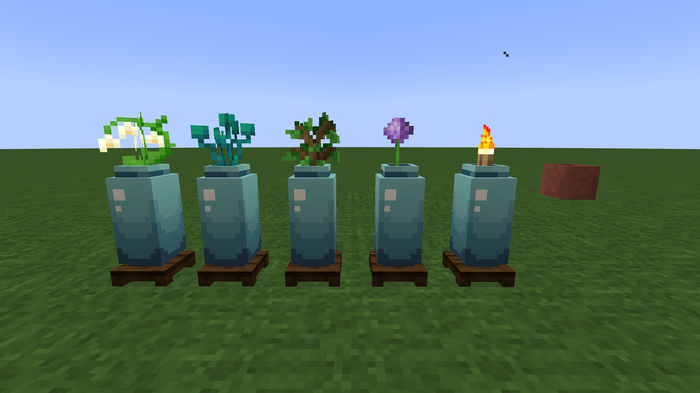

# 青瓷瓶

​     

| 添加此物品的原因 | 代替使用实体渲染的陶罐，改善游戏性能 |
| :--------------- | :----------------------------------- |
| 稀有度           | 罕见                                 |
| 命名空间         | comfysky:celadon_vase                |
| 添加版本         | 17.1.4                               |

​     

## 获取

组装台使用碎片合成

​     

## 用途

### 装饰方块

青瓷瓶的顶部可以隐藏一个花盆

​     

## 交互

​     

## 数值表

<table border=1> <tr> <th align=left colspan=3> 标签 </th> </tr> <tr> <td align=center rowspan=1 width=120; style="vertical-align:middle"> 方块标签 </td> <td> #minecraft:mineable/pickaxe </td> </tr> </table>

​     

## 历史

<table border=1 style="width:100% ;height:100%"> <tr> <th align=center colspan=3>Java版</th> </tr> <tr> <td align=center rowspan=1 width=120; style="vertical-align:middle">1.19.4</td> <td width=120;>17.1.4</td> <td>加入了青瓷瓶</td> </tr> </table>

​     

## 你知道吗

1.青瓷瓶的原型来自于ultramarine中的青瓷瓶

​     

## 参考

​     

