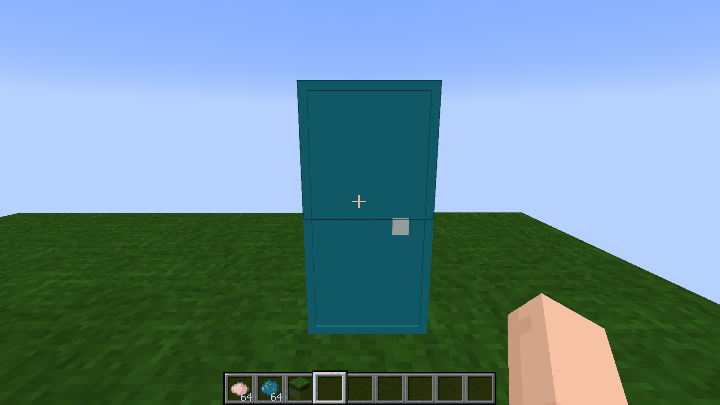
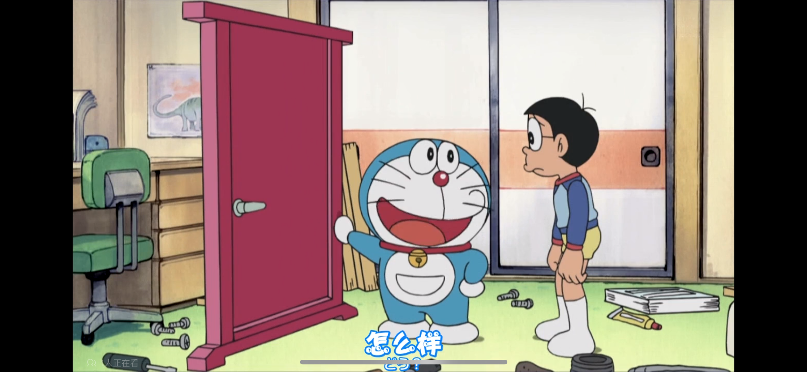
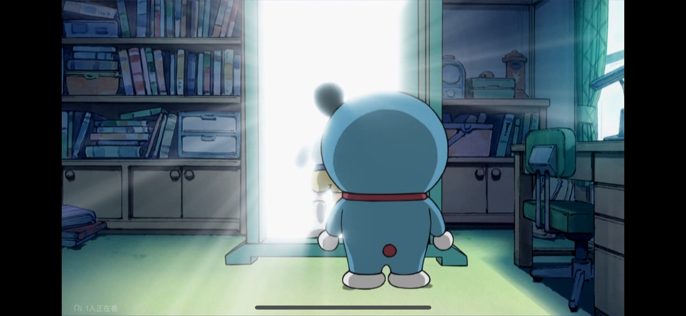

# 定向传送门

## 青色定向传送门

<div align=center></div>

​     

| 添加此物品的原因 | 主世界远距离穿行通过地狱门过于繁琐    |
| :--------------- | :------------------------------------ |
| 稀有度           | 罕见                                  |
| 命名空间         | comfysky:cyan_directional_portal_door |
| 添加版本         | 17.1.12                               |

​     

## 粉色定向传送门（定向传送门变种）

<div align=center></div>

​     

| 添加此物品的原因 | 主世界远距离穿行通过地狱门过于繁琐    |
| :--------------- | :------------------------------------ |
| 稀有度           | 罕见                                  |
| 命名空间         | comfysky:pink_directional_portal_door |
| 添加版本         | 17.1.12                               |

​     

## 黄绿色定向传送门（定向传送门变种）

<div align=center></div>

​     

| 添加此物品的原因 | 主世界远距离穿行通过地狱门过于繁琐    |
| :--------------- | :------------------------------------ |
| 稀有度           | 罕见                                  |
| 命名空间         | comfysky:lime_directional_portal_door |
| 添加版本         | 17.1.13                               |

​     

## 黄色定向传送门（定向传送门变种）

<div align=center></div>

​     

| 添加此物品的原因 | 主世界远距离穿行通过地狱门过于繁琐      |
| :--------------- | :-------------------------------------- |
| 稀有度           | 罕见                                    |
| 命名空间         | comfysky:yellow_directional_portal_door |
| 添加版本         | 17.1.13                                 |

​     

## 获取

### 古物碎片合成

（仅限）青色定向传送门由组装台使用碎片合成

​     

### 染色

定向传送门可由玩家手持对应的颜色染料右键定向传送门更改颜色

​     

## 用途

### 无限距离离传送玩家

Minecraft的地狱门传送系统需要不断在两个世界内来回切换，虽然能节省部分时间，但是依旧操作过于麻烦，有时还会导致串门之类让人恼火的问题。

在当前版本中对定向传送门做了很多限制，比如：

1.只能在主世界进行传送

2.只有玩家实体才可以被传送

3.传送需要消耗一定经验，传送距离越远消耗经验越多，2000格曼哈顿距离内传送不消耗经验

4.只有通过组装台修复古物的方式进行合成

​      

## 交互

### 染色

当玩家主手上有染料时，可以右键将定向传送门染色

**各版本可染染色列表**

|        | 图例                                                         | 17.1.12 | 17.1.13 |
| ------ | ------------------------------------------------------------ | ------- | ------- |
| 青色   |  | 支持    | 支持    |
| 粉色   |  | 支持    | 支持    |
| 黄绿色 |  |         | 支持    |
| 黄色   |  |         | 支持    |



​     

### 创建并激活传送门

要想创建一个传送门，我们首先需要5样东西，

**第一步：准备需要准备的材料**

| 材料清单                                                     |
| ------------------------------------------------------------ |
| minecraft:filled_map **打开的地图** |
| minecraft:glass_pane **玻璃板** |
| minecraft:cartography_table **制图台** |
| minecraft:pink_banner **粉色旗帜**     注意：这里的旗帜需要和你想创建的传送门颜色对应 |
| comfysky:pink_directional_portal_door **粉色定向传送门** |

​     

**第二步：用地图标记一个旗帜地点，并使用制图台锁定地图**

**第三步：找一个地方放置你喜欢颜色的定向传送门**

**第四步：手持标记好旗帜位置的打开的地图，并右键你放置的定向传送门。如果成功你会听到信标激活的音效**

Note: 如果传送门未能成功创建，最好检查一下旗帜上方的位置是否有方块遮挡

​     

### 拆除一个传送门

Shift+右键一个传送门以解除传送门绑定

​    

### 传送

当完成创建传送门时，你应该可以空手右键将传送门打开。（在没有成功创建传送门的情况下是打不开的，这也是判断传送门是否被成功创建的重要标准）

为了平衡性，只有玩家实体才能被传送

同时玩家**需要充足的经验**，2000格曼哈顿距离内传送是不消耗任何经验的，大于2000格曼哈顿距离会消耗一定的经验值，具体计算如下：

```java
    public static int calculateExperienceNeededForTeleport(BlockPos start, BlockPos end) {
        int i = ComfyskyMathHelper.getManhattanDistance(start, end);
        if (i <= 2000) return 0;
        return Math.max(0, (int) Math.round(20 * Math.log10(i / 2000.0)));
    }
```

这边列举一些常见的距离和经验计算结果方便玩家参考：

| 距离（单位：曼哈顿距离） | 消耗经验等级 |
| ------------------------ | ------------ |
| 0~2000                   | 0            |
| 3000                     | 4            |
| 4000                     | 6            |
| 5000                     | 8            |
| 10000                    | 14           |
| 20000                    | 20           |

​     

当玩家实体穿过门时，将尝试进行传送。如果成功传送成功，你将会听到传送门传送成功的音效:

<audio controls> <source src="../../../resources/sound/teleport_success.mp3" type="audio/mpeg"> </audio>

传送过后玩家将被给予300tick(15秒)的传送冷却时间，这段时间玩家不能再次传送

​     

### 当玩家无法被传送时

使用铜调试棒shift+右键传送门来诊断当前玩家不能被传送的原因

诊断分析查看 **定向传送门-数值表-传送结果**

​     

## 数值表

### 传送结果

| 传送结果（TeleportActionResult）       | 传送是否成功 | 解释                                                         |
| -------------------------------------- | ------------ | ------------------------------------------------------------ |
| SUCCESS                                | 成功         | 传送门可以传送玩家                                           |
| GENERAL_FAIL                           | 失败         | 没有指定类型的失败                                           |
| DOOR_CLOSED                            | 失败         | 门无法开启，一种最常见的问题，可能是传送位置不安全或没有插入地图导致 |
| OUT_SIDE_OF_OVERWORLD                  | 失败         | 不在主世界，传送门只有在主世界才能正常使用                   |
| PLAYER_IN_COOLDOWN                     | 失败         | 玩家处于冷却状态，等待15秒即可取消冷却                       |
| OPPOSITE_DOOR_NOT_CREATED              | 失败         | 没有创建传送门出口，这种情况通常是玩家不小心拆除门后导致，只需要重新激活传送门即可 |
| DESTINATION_NOT_EXIST                  | 失败         | 目的地不存在，这种情况通常是由于超出世界边界导致，建议重新激活传送门或更改传送位置 |
| PLAYER_DOES_NOT_HAVE_ENOUGH_EXPERIENCE | 失败         | 玩家没有足够的经验来完成当前传送                             |

​     

| 常量                          | 数据 | 数据类型 |
| :---------------------------- | ---- | -------- |
| @Debuggable                   | true | boolean  |
| @DyeColor                     | ？   | DyeColor |
| @DEFAULT_PORTAL_DOOR_COOLDOWN | 300  | int      |
| @FREE_TELEPORT_DISTANCE       | 2000 | int      |

<table border=1> <tr> <th align=left colspan=3> 标签 </th> </tr> <tr> <td align=center rowspan=1 width=120; style="vertical-align:middle"> 方块标签 </td> <td> #minecraft:mineable/axe </td> </tr> <tr> <td align=center rowspan=3 width=120; style="vertical-align:middle"> NBT标签 </td> <td> #Name </td> </tr> <tr> <td> #BlockPos </td> </tr> <tr> <td> #Inventory </td> </tr> </table>

​     

## 历史

<table border=1 style="width:100% ;height:100%"> <tr> <th align=center colspan=3>Java版</th> </tr> <tr> <td align=center rowspan=4 width=120; style="vertical-align:middle">1.20.1</td> <td align=center rowspan=2 width=120; style="vertical-align:middle">17.1.12</td> <td>加入了粉色定向传送门</td> </tr> <tr> <td>加入了青色定向传送门</td> </tr> <tr> <td align=center rowspan=2 width=120; style="vertical-align:middle">17.1.13</td> <td>加入了黄绿色定向传送门</td> </tr> <tr> <td>加入了黄色定向传送门</td> </tr> </table>

​     

## 你知道吗

1.定向传送门致敬了动漫《哆啦A梦》中的夏威夷专用的任意门





​     

## 参考

[任意门 | 哆啦A夢wiki | Fandom](https://doraemon.fandom.com/zh/wiki/任意門?variant=zh-cn)

[一起来做任意门吧_哔哩哔哩_bilibili](https://www.bilibili.com/video/BV15W411k71V/?spm_id_from=333.337.search-card.all.click&vd_source=3d47f7f15977e64edde817f5a2a56593)

​     


