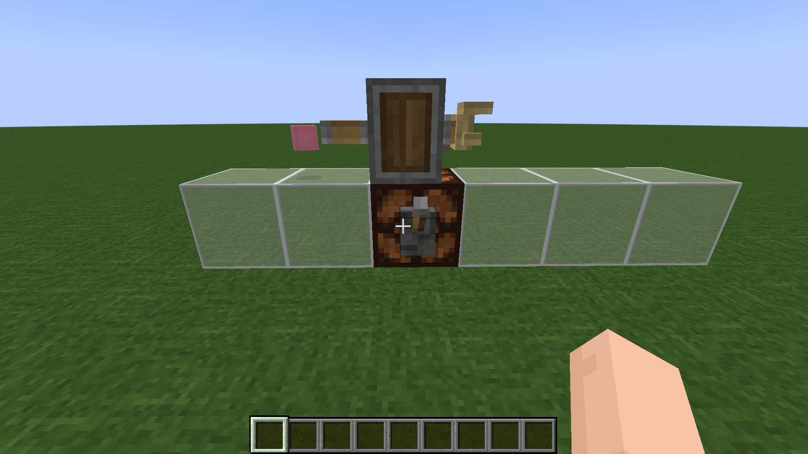
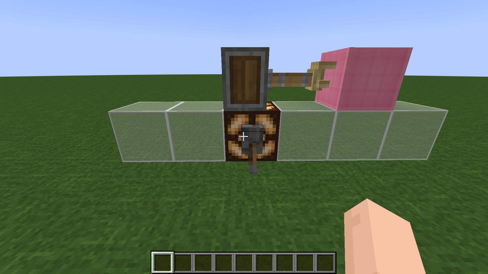
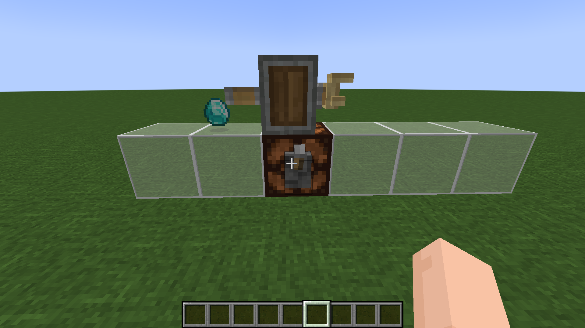
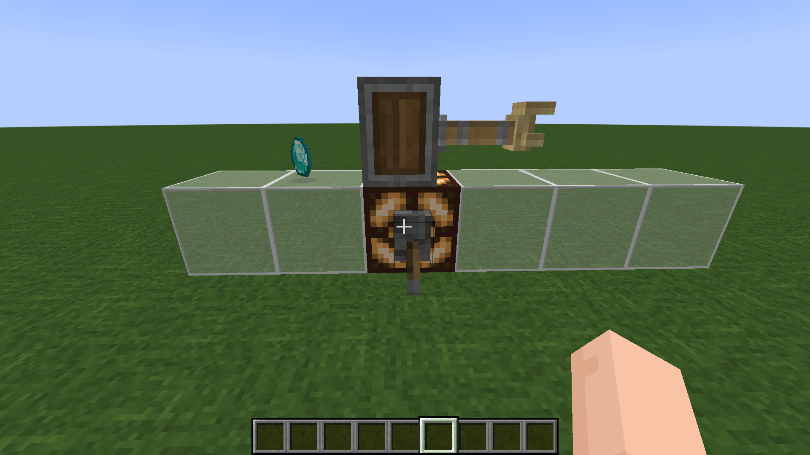
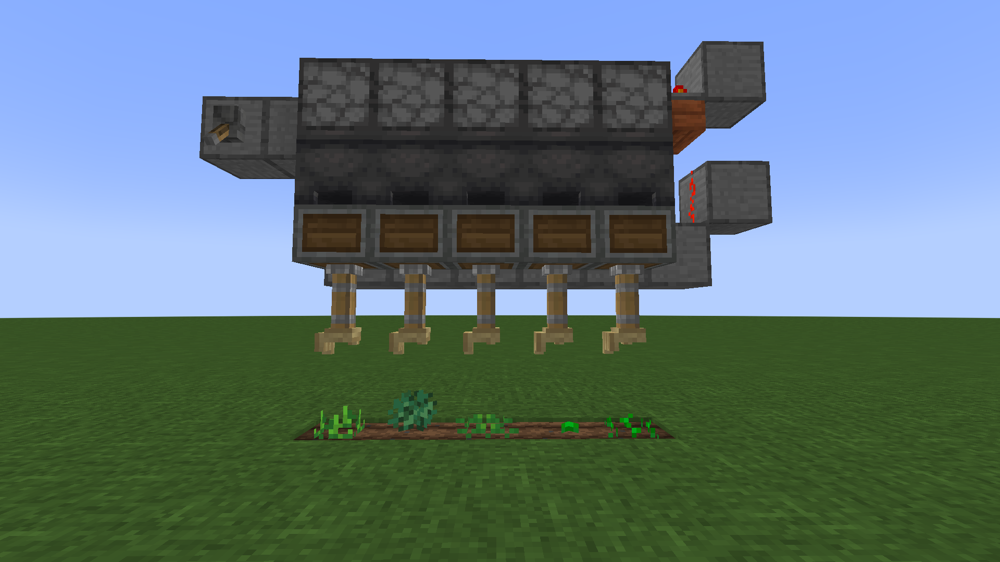
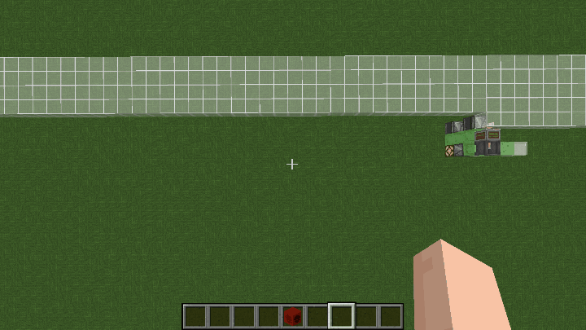

# 机械放置器

​     

| 添加此物品的原因 | Minecraft实现完全自动化    |
| :--------------- | :------------------------- |
| 稀有度           | 罕见                       |
| 命名空间         | comfysky:mechanical_placer |
| 添加版本         | 17.1.3                     |

​     

## 获取

组装台使用碎片合成

​     

## 用途

### 放置方块

机械放置器朝向的反方向上有物品实体(如上图所示的粉红色羊毛物品实体)

​     

当机器充能时，物品实体会被机械放置器给拾取到，并尝试放置该物品实体到方块朝向的前第二格处

​      

若该物品实体不是方块物品实体*（比如上图中的钻石）或前方没有空间可以放置方块

方块物品实体：继承BlockItem.class的物品

​     

当机械放置器被激活时，不满足放置条件时不会放置任何的方块

​     

### 自动种植

利用红石信号激活的原理建造的简单自动作物种植机

​     

### 自动铺路

可以被粘液块粘连

可以被活塞推动

配合飞行器可以实现自动放置方块的效果

​     

## 交互

当有红石信号时激活

​     

## 数值表

| 常量   | 数据 | 数据类型 |
| :----- | ---- | -------- |
| @DELAY | 1    | int      |

<table border=1> <tr> <th align=left colspan=3> 标签 </th> </tr> <tr> <td align=center rowspan=1 width=120; style="vertical-align:middle"> 方块标签 </td> <td> #minecraft:mineable/pickaxe </td> </tr> </table>

​     

## 历史

<table border=1 style="width:100% ;height:100%"> <tr> <th align=center colspan=3>Java版</th> </tr> <tr> <td align=center rowspan=4 width=120; style="vertical-align:middle">1.19.4</td> <td width=120;>17.1.3</td> <td>加入了机械放置器</td> </tr> <tr> <td align=left rowspan=3 width=120; style="vertical-align:middle">17.1.4</td> <td>修复了机械放置器模型由于像素冲突导致贴图闪烁的BUG</td> </tr> <tr> <td>现在机械放置器在尝试放置方块失败后不再向前弹射物品</td> </tr> </table>

​     

## 你知道吗

1.机械放置器的原型来自于机械动力中的机械手

​     

## 参考

​     

