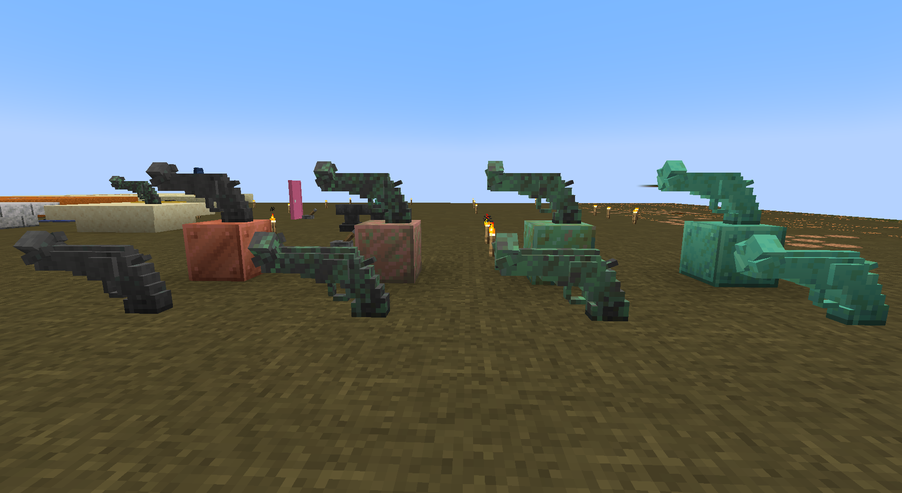

# 《非暴力》系列方块

## 《非暴力》

| 添加此物品的原因 |                       |
| :--------------- | :-------------------- |
| 稀有度           | 稀有                  |
| 命名空间         | comfysky:non_violence |
| 添加版本         | 17.1.10               |

​     

## 斑驳《非暴力》

| 添加此物品的原因 |                               |
| :--------------- | :---------------------------- |
| 稀有度           | 稀有                          |
| 命名空间         | comfysky:exposed_non_violence |
| 添加版本         | 17.1.12                       |

​     

## 锈蚀《非暴力》

| 添加此物品的原因 |                                  |
| :--------------- | :------------------------------- |
| 稀有度           | 稀有                             |
| 命名空间         | comfysky:weathered__non_violence |
| 添加版本         | 17.1.12                          |

​     

## 氧化《非暴力》

| 添加此物品的原因 |                                |
| :--------------- | :----------------------------- |
| 稀有度           | 稀有                           |
| 命名空间         | comfysky:oxidized_non_violence |
| 添加版本         | 17.1.12                        |

​     

## 涂蜡的《非暴力》

| 添加此物品的原因 |                             |
| :--------------- | :-------------------------- |
| 稀有度           | 稀有                        |
| 命名空间         | comfysky:waxed_non_violence |
| 添加版本         | 17.1.10                     |

​     

## 涂蜡的斑驳《非暴力》

| 添加此物品的原因 |                                     |
| :--------------- | :---------------------------------- |
| 稀有度           | 稀有                                |
| 命名空间         | comfysky:waxed_exposed_non_violence |
| 添加版本         | 17.1.12                             |

​     

## 涂蜡的锈蚀《非暴力》

| 添加此物品的原因 |                                        |
| :--------------- | :------------------------------------- |
| 稀有度           | 稀有                                   |
| 命名空间         | comfysky:waxed_weathered__non_violence |
| 添加版本         | 17.1.12                                |

​     

## 涂蜡的氧化《非暴力》

| 添加此物品的原因 |                                      |
| :--------------- | :----------------------------------- |
| 稀有度           | 稀有                                 |
| 命名空间         | comfysky:waxed_oxidized_non_violence |
| 添加版本         | 17.1.12                              |

​     

## 获取

1.使用任意等级的挖掘铲挖掘可疑的草方块有概率获取 **氧化《非暴力》**，详细查看**可疑的草方块-交互**

2.打蜡或除蜡

3.雷击任意氧化程度的《非暴力》转化为《非暴力》

4.自然氧化

​     

## 用途

### 装饰方块

装饰方块，占据两格方块位置

​     

## 交互

### 自然氧化/斧头除锈

《非暴力》系列方块在**未打蜡时**会自然氧化，顺序是：

| 氧化前         | 氧化后         |
| -------------- | -------------- |
| 《非暴力》     | 斑驳《非暴力》 |
| 斑驳《非暴力》 | 锈蚀《非暴力》 |
| 锈蚀《非暴力》 | 氧化《非暴力》 |

​     

《非暴力》系列方块在**氧化时**可用斧子除锈，顺序是：

| 除锈前         | 除锈后         |
| -------------- | -------------- |
| 斑驳《非暴力》 | 《非暴力》     |
| 锈蚀《非暴力》 | 斑驳《非暴力》 |
| 氧化《非暴力》 | 锈蚀《非暴力》 |

​     

### 打蜡/除蜡

《非暴力》系列方块在**打蜡时**可用斧子除蜡，顺序是：

| 除蜡前               | 除蜡后         |
| -------------------- | -------------- |
| 涂蜡的《非暴力》     | 《非暴力》     |
| 涂蜡的斑驳《非暴力》 | 斑驳《非暴力》 |
| 涂蜡的锈蚀《非暴力》 | 锈蚀《非暴力》 |
| 涂蜡的氧化《非暴力》 | 氧化《非暴力》 |

​     

《非暴力》系列方块在**未打蜡时**可用蜜脾涂蜡防止氧化，顺序是：

| 涂蜡前     | 涂蜡后               |
| ---------- | -------------------- |
| 《非暴力》 | 涂蜡的《非暴力》     |
| 《非暴力》 | 涂蜡的斑驳《非暴力》 |
| 《非暴力》 | 涂蜡的锈蚀《非暴力》 |
| 《非暴力》 | 涂蜡的氧化《非暴力》 |

​     

### 雷击

《非暴力》系列方块在**未打蜡时**，雷击任意氧化程度的《非暴力》转化为《非暴力》

在打蜡时雷击则无效

​     

## 数值表

| 常量              | 数据 | 数据类型         |
| :---------------- | ---- | ---------------- |
| @Oxidizable.Level | ?    | Oxidizable.Level |

<table border=1> <tr> <th align=left colspan=3> 标签 </th> </tr> <tr> <td align=center rowspan=2 width=120; style="vertical-align:middle"> 方块标签 </td> <td> #minecraft:mineable/pickaxe </td> </tr> <tr> <td> #need_stone_tool </td> </tr> </table>

​     

## 历史

<table border=1 style="width:100% ;height:100%"> <tr> <th align=center colspan=5>Java版</th> </tr> <tr> <td align=center rowspan=1 width=120 style="vertical-align:middle">1.19.4</td> <td align=center rowspan=1 width=120 style="vertical-align:middle">17.1.10</td> <td>加入了《非暴力》</td> </tr> <tr> <td align=center rowspan=4 width=120 style="vertical-align:middle">1.20.1</td> <td align=center rowspan=4 width=120 style="vertical-align:middle">17.1.12</td> <td>加入了 《非暴力》系列方块</td> </tr> <tr> <td>取消了《非暴力》方块的寻路，现在该方块的寻路被设置为false</td> </tr> <tr> <td>修正了简体中文中有关非暴力的命名方式，现在《非暴力》在中文中带书名号</td> </tr> <tr> <td>现在可疑的草方块中可获得的物品由《非暴力》更改为氧化的《非暴力》，其成就触发物品不受影响</td> </tr> </table>

​     

## 你知道吗

1.非暴力是唯一一个不需要使用组装台修复的古物，你需要雷击或用斧子除锈来恢复其本来的颜色

​     

## 参考

[《非暴力》 | 欢迎访问联合国受赠礼品集 (un.org)](https://www.un.org/ungifts/zh/《非暴力》)

[Non-Violence (sculpture) - Wikipedia](https://en.wikipedia.org/wiki/Non-Violence_(sculpture))

​     

