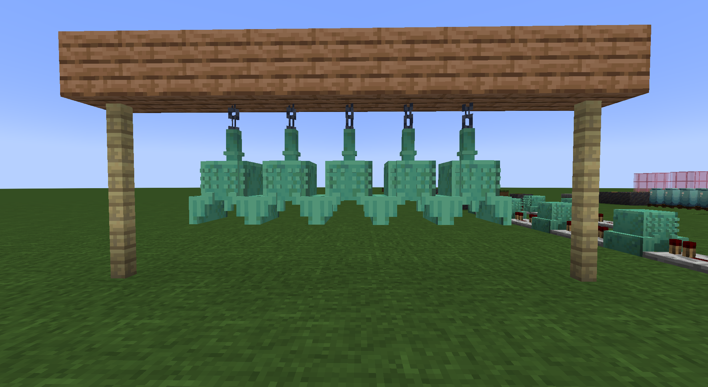

# 古代中国编钟

​     

| 添加此物品的原因 | 增加游戏趣味性                          |
| :--------------- | :-------------------------------------- |
| 稀有度           | 罕见                                    |
| 命名空间         | comfysky:traditional_chinese_chime_bell |
| 添加版本         | 17.1.8                                  |

​     

## 获取

组装台使用碎片合成

​     

## 用途

### 装饰方块

可以悬挂在方块的底部，占据两格方块高度

​     

### 演奏音乐

这个一个具有完整功能的编钟，你可以用它弹奏出D大调的7个音符和E大调的5个音符

当玩家左键点击或红石信号充能时编钟底部（part=bottom）位置时，会播放对应音符

当玩家右键编钟底部（part=bottom）时会切换至下一个音符

​     

## 交互

右键切换至下一个音符

左键或接收红石信号时播放音乐

当方块顶部有可支撑悬挂的方块时会切换为悬挂状态

​     

## 数值表

<table border=1> <tr> <th align=left colspan=3> 标签 </th> </tr> <tr> <td align=center rowspan=4 width=120; style="vertical-align:middle"> 方块标签 </td> <td> #minecraft:need_stone_tool </td> </tr> <tr> <td> #minecraft:mineable/pickaxe </td> </tr> </table>     

​     

## 历史

<table border=1 style="width:100% ;height:100%"> <tr> <th align=center colspan=3>Java版</th> </tr> <tr> <td align=center rowspan=1 width=120; style="vertical-align:middle">1.19.4</td> <td width=120;>17.1.8</td> <td>加入了古代中国编钟</td> </tr> </table>

​     

## 你知道吗

青铜器的使用是定义一个文明的重要标准

​     

## 参考

[曾侯乙编钟 - 维基百科，自由的百科全书 (wikipedia.org)](https://zh.wikipedia.org/wiki/曾侯乙编钟)

​     

