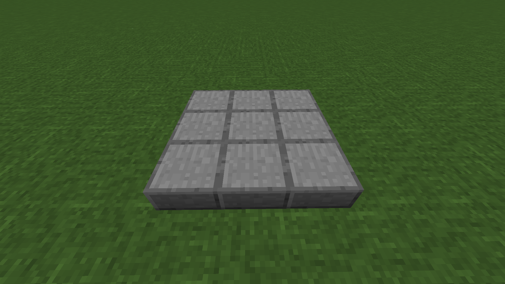

# 组装台

​     

| 添加此物品的原因 | 减少GUI使用，合成古物     |
| :--------------- | :------------------------ |
| 稀有度           | 常见                      |
| 命名空间         | comfysky:assembly_station |
| 添加版本         | 17.1.3                    |

​     

## 获取

工作台合成

​     

## 用途

合成古物

​     

## 交互

### 多方块结构

组装台是一个多方块结构，它底座由9个组装台拼接而成。当组装物品时，也需要确保3X3平台上方这几个方块是空气，否则多方块结构将不生效。

​     

这边以机械放置器为例，我们需要准备组装机械放置器的3个碎片。然后任意使用其中的一个碎片点击底部3X3平台中心的那个方块，之后我们就可以看到组装台上出现了对应的方块模型，将其余碎片组装完成后，组装的物品会以掉落物的形式掉落，同时你会听到组装成功的提示音。

<audio id="audio" controls="" preload="none">
      <source id="mp3" src="../../resources/sound/assembly_station_success.mp3">
</audio>

​     

## 数值表

| 常量        | 数据 | 数据类型 |
| :---------- | ---- | -------- |
| @Debuggable | true | boolean  |

<table border=1> <tr> <th align=left colspan=3> 标签 </th> </tr> <tr> <td align=center rowspan=1 width=120; style="vertical-align:middle"> 方块标签 </td> <td> #minecraft:mineable/pickaxe </td> </tr> </table>

​     

## 历史

<table border=1 style="width:100% ;height:100%"> <tr> <th align=center colspan=3>Java版</th> </tr> <tr> <td align=center rowspan=1 width=120; style="vertical-align:middle">1.19.4</td> <td width=120;>17.1.3</td> <td>加入了组装台</td> </tr> </table>

​     

## 你知道吗

组装台的原型来自于波西亚时光的组装台

​     

## 参考

​     

