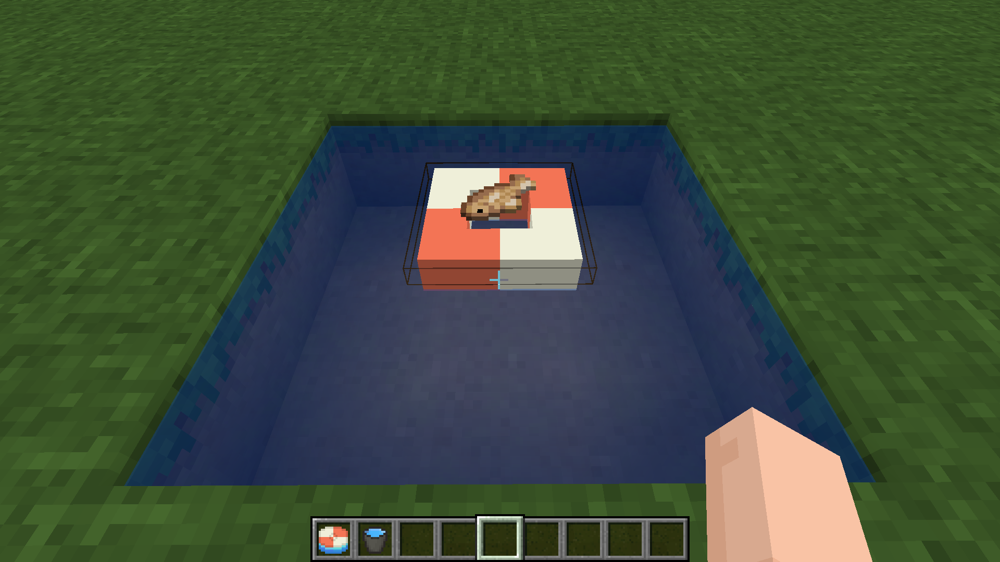
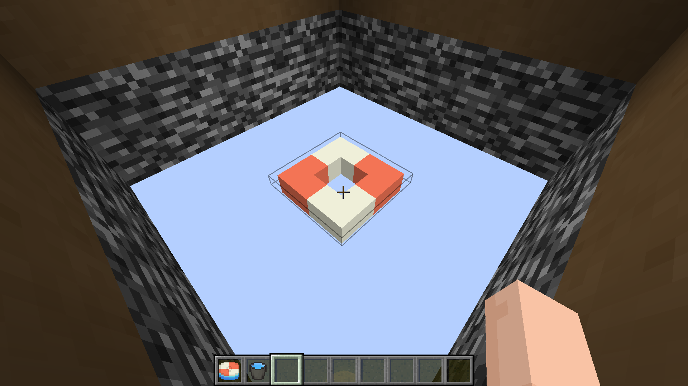

# 捕鱼陷阱

​     

| 添加此物品的原因 | Minecraft实现自动钓鱼，玩家物品掉入虚空后将会被删除，鼓励玩家前往针叶林群系 |
| :--------------- | :----------------------------------------------------------- |
| 稀有度           | 常见                                                         |
| 命名空间         | comfysky:fish_trap                                           |
| 添加版本         | 17.0.13                                                      |

​     

## 获取

工作台合成

​     

## 用途

### 捕鱼

放置在水面上时，固定640tick(32秒)可捕获幸运值为0时的钓鱼物品

​     

### 捕获玩家遗失物品

捕鱼陷阱和浮木一样可以放置在世界Y轴最低值，当放置在世界Y轴最低值时，会优先从玩家遗失物品列表*中抽取0-1个物品。如果没有抽中物品，那么会捕获幸运值为0时的钓鱼物品。

玩家遗失物品列表：每个玩家默认自带27个遗失物品栏，必须是玩家丢弃在虚空且稀有度等级高于普通的物品会被加入玩家遗失物品列表。

​     

## 交互

1.右键放置在水源方块上（包括含水方块）

2.当捕获物品时，右键捕鱼陷阱可获取捕获的物品

​     

## 数值表

| 常量   | 数据              | 数据类型   |
| :----- | ----------------- | ---------- |
| @LOOTS | minecraft:fishing | identifier |
| @LUCK  | 0                 | int        |

<table border=1> <tr> <th align=left colspan=3> 标签 </th> </tr> <tr> <td align=center rowspan=1 width=120; style="vertical-align:middle"> 方块标签 </td> <td> #minecraft:mineable/axe </td> </tr> <tr> <td align=center rowspan=3 width=120; style="vertical-align:middle"> NBT标签 </td> <td> #owner </td> </tr> <tr> <td> #lastInteractTime </td> </tr> <tr> <td> #Items </td> </tr> </table>

​     

## 历史

<table border=1 style="width:100% ;height:100%"> <tr> <th align=center colspan=3>Java版</th> </tr> <tr> <td align=center rowspan=2 width=120; style="vertical-align:middle">1.19.2</td> <td width=120;>17.0.13</td> <td>加入了捕鱼陷阱</td> </tr> <tr> <td>17.0.14</td> <td>现在捕鱼陷阱可以捕获玩家遗失物品</td> </tr> <tr> <td align=center rowspan=1 width=120; style="vertical-align:middle">1.19.4</td> <td width=120;>17.1.4</td> <td>现在捕鱼陷阱添加了captured 方块状态</td> </tr> </table>

​     

## 你知道吗

1.捕鱼陷阱的原型源自浮岛物语中的捕鱼陷阱

2.使用fill command放置的捕鱼陷阱玩家uuid是随机生成的

3.玩家掉落虚空的物品的计量单位为物品组，若两次投下相同的物品，则占用2个物品组

4.当遗失物品栏装满时，会默认覆盖下标为0的物品组

​     

## 参考

​     

