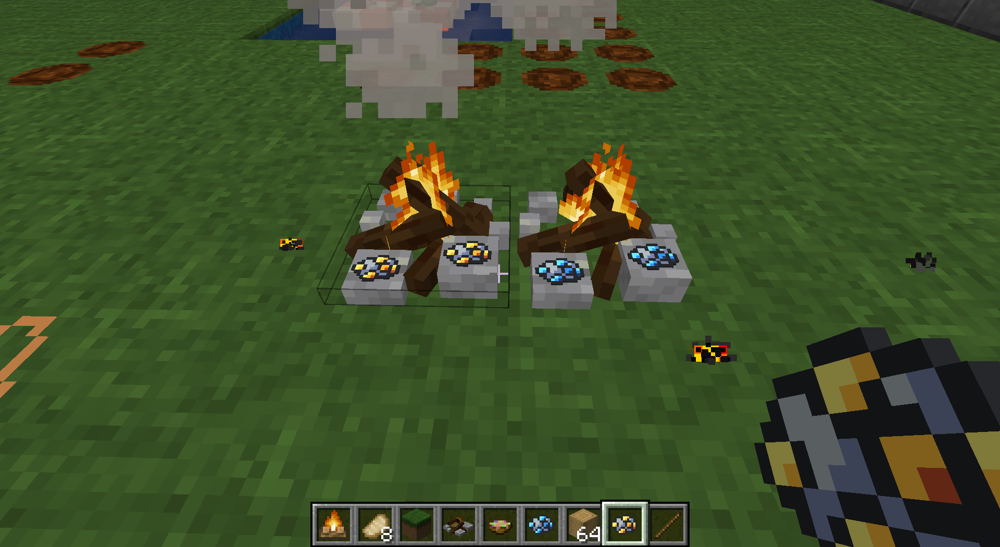

# 简易篝火

<div align=center></div>

​     

| 添加此物品的原因 | 烧炼碎矿，空岛前期无法获取光源，模组前置 |
| :--------------- | :--------------------------------------- |
| 稀有度           | 常见                                     |
| 命名空间         | comfysky:simple_bonfire                  |
| 添加版本         | 17.1.8                                   |

​     

## 获取

工作台合成

​     

## 用途

### 模组前置

在李芒果空岛前期，可以通过简易篝火熔炼碎矿从而获取金属粒，从而增加了一种除打僵尸掉铁锭外额外的一种获取铁锭的方式

当玩家放置简易篝火后，篝火会持续燃烧200Ticks（10秒）如果在这段时间内未添加燃料则篝火会在200Ticks 后熄灭

注意：李芒果空岛前期无法获取打火石，请格外珍惜火源，不要让其熄灭，否则使用非精准采集的工具破坏时会损失大约72%原料

​     

### 取出火把（1.20.1-17.1.15+）

在篝火点燃时，且拥有大于2000tick燃烧时长时，**主手手持木棍右键**简易篝火取出1根燃烧的火把，同时减少一定时长的燃烧时间

燃烧的火把燃烧时长计算公式：

```java
protected static final NormalDistribution DISTRIBUTION = new NormalDistribution(50, 15.6);

//理想燃烧时长取当前 (当前燃烧时长-1000,24000L)ticks, 火把燃烧最长时间是24000tick
long idealBurningTime = Math.min((burningTime - 1000), 24000L);
double zValue =DISTRIBUTION.percentile(world.getRandom().nextDouble());
//rationalized burnTime using normal distribution
long torchBurningTime = (long) ((long) idealBurningTime * (zValue / 100.0));
```

取出火把燃烧时长按mean=50, standard deviation =15.6的正态分布计算，玩家有80%的概率取出一个平均值在理想燃烧时长40%~70%的火把，最理想的情况下是取出一个无限接近于24000ticks 燃烧值的火把（约合20分钟现实时间），最糟糕的情况下是取出一个燃烧值为1000ticks燃烧值的火把（约合50秒现实时间）

​     

### 烧炼物品



简易篝火具有**两个烧炼物品槽**，位于简易篝火体积最大的两块石头上

安装**REI**后鼠标指针悬浮于该物品上，可以按U键可查看所有加入的简易篝火配方

当物品烧炼完成后不会像原版篝火那样直接掉落

注意：当篝火熄灭时，未完成烧炼的物品进度将重置

​     

## 交互

1.主手手持木棍（minecraft:stick）右键点击篝火，减少篝火部分燃烧值，取出一根燃烧的火把

2.主手手持火焰弹或打火石右键点击篝火，点燃篝火

3.手持铲子右键点击篝火，熄灭篝火

4.手持任意燃烧值不为0的物品右键篝火，增加对应燃烧时间，最大燃烧时间为5184000ticks

5.手持任意物品右键烧炼槽位，GUI会显示放入的物品，并尝试烧炼，再次右键烧炼槽位取出物品

6.使用精准采集附魔的物品会掉落一个简易篝火，否则则会掉落18至27个碎石

​     

## 数值表

| 常量                 | 数据          | 数据类型 |
| :------------------- | ------------- | -------- |
| initial burning time | 200 ticks     | long     |
| MAX_BURNING_TIME     | 5184000 ticks | long     |
| inventory size       | 2             | integer  |

<table border=1> <tr> <th align=left colspan=3> 标签 </th> </tr> <tr> <td align=center rowspan=4 width=120; style="vertical-align:middle"> 方块标签 </td> <td> #minecraft:mineable/axe </td> </tr> </table>     

​     

## 历史

<table border=1 style="width:100% ;height:100%"> <tr> <th align=center colspan=3>Java版</th> </tr> <tr> <td align=center rowspan=2 width=120; style="vertical-align:middle">1.19.4</td> <td width=120;>17.1.8</td> <td>加入了简易篝火</td> </tr> <tr> <td>17.1.10</td> <td>修复了玩家手持简易篝火时错误的显示</td> </tr> <tr> <td align=center rowspan=3 width=120; style="vertical-align:middle">1.20.1</td> <td align=left rowspan=3 width=120; style="vertical-align:middle">17.1.15</td> <td>在光照平衡性更新中简易篝火中取出火把（minecraft：torch）更改为取出燃烧的火把（comfysky:burning_torch）</td> </tr> <tr> <td>更改了简易篝火的合成配方，无法使用木炭来合成简易篝火</td> </tr> <tr> <td>简易篝火的最大燃烧值由5000更改为5184000</td> </tr> </table>

​     

## 你知道吗

1.简易篝火使用的配方类型是壁炉（RecipeType.FIREPLACE），这并非是错误

2.简易篝火的原型源自于漫漫长夜（The Long Dark）中的营火

​     

## 参考

​     


