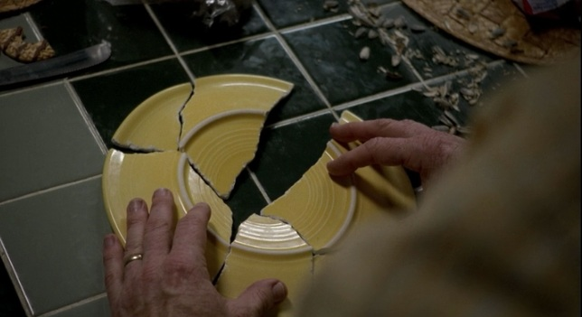

# 古罗马玻璃盘碎片

## 古罗马玻璃盘1号碎片

​     

| 添加此物品的原因 | 合成古罗马玻璃盘                           |
| :--------------- | :----------------------------------------- |
| 稀有度           | 罕见                                       |
| 命名空间         | comfysky:ancient_roman_glass_plate_piece_1 |
| 添加版本         | 17.1.15                                    |

​     

## 获取

使用任意等级的挖掘铲挖掘可疑的草方块有概率获取，详细查看**可疑的草方块-交互**

​     

## 用途

在组装台合成任意颜色的古罗马玻璃盘

​     

## 交互

1.右键组装台将碎片进行组装，详细查看**组装台-交互**

​     

## 数值表

| 常量        | 数据 | 数据类型 |
| :---------- | ---- | -------- |
| @MAX_PIECES | 1    | int      |

​     

## 历史

<table border=1 style="width:100% ;height:100%"> <tr> <th align=center colspan=3>Java版</th> </tr> <tr> <td align=center rowspan=1 width=120; style="vertical-align:middle">1.20.1</td> <td width=120;>17.1.15</td> <td>加入了古罗马玻璃盘1号碎片</td> </tr> <tr></tr> </table>

​     

## 你知道吗

古罗马玻璃碎片的贴图致敬了美剧 Breaking Bad

​     

## 参考

​     

