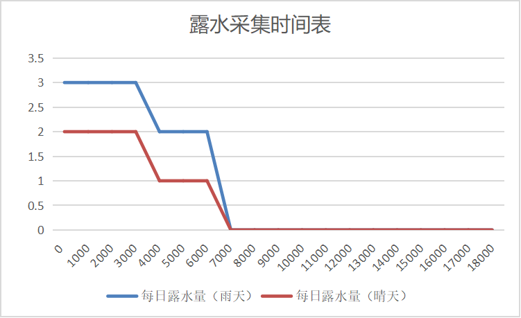

# 露水花

​     

| 添加此物品的原因 | 李芒果空岛前期获取水难度较大 |
| :--------------- | :--------------------------- |
| 稀有度           | 常见                         |
| 命名空间         | comfysky:dew_flower          |
| 添加版本         | 17.0.3                       |

​     

## 获取

花种子有概率种出露水花

​     

## 用途

### 露水收集

1.露水采集需要天空光需要大于0

2.使用水瓶或露水瓶右键露水花可以采集露水，详细数据见**露水花-用途-露水收集时间表**

3.雨天可以额外获得一滴露水

​     

### 露水收集时间表

| 游戏日时间（Time of Day） | 可获取露水量（晴天） | 可获取露水量（雨天） |
| ------------------------- | -------------------- | -------------------- |
| 0-3000                    | 2                    | 3                    |
| 3000-6000                 | 1                    | 2                    |
| 6000-24000                | 0                    | 0                    |

​     

### 食用

露水花可以制作谜之炖菜，食用后产生速度效果，时长4秒

​     

### 盆栽

可以放置在花盆中

​     

## 交互

1.使用空瓶对着露水花右键转换为露水瓶

2.可以放置在方块标签为minecraft:dirt或treasurehuntlib:farmland的方块上

3.使用铜调试棒右键获取当前时间可获取露水的量

​     

## 数值表

| 常量             | 数据 | 数据类型 |
| :--------------- | ---- | -------- |
| @broke instantly | true | boolean  |
| @debugable       | true | boolean  |

<table border=1> <tr> <th align=left colspan=3> 标签 </th> </tr> <tr> <td align=center rowspan=1 width=120; style="vertical-align:middle"> 方块标签 </td> <td> #minecraft:small_flowers </td> </tr> <tr> <td align=center rowspan=1 width=120; style="vertical-align:middle"> 物品标签 </td> <td> #minecraft:small_flowers </td> </tr> <tr> <td align=center rowspan=1 width=120; style="vertical-align:middle"> NBT标签 </td> <td> lastInteractTime </td> </tr> </table>

​     

## 历史

<table border=1 style="width:100% ;height:100%"> <tr> <th align=center colspan=3>Java版</th> </tr> <tr> <td align=center rowspan=5 width=120; style="vertical-align:middle">1.19.2</td> <td width=120;>17.0.3</td> <td>加入了露水花</td> </tr> <tr> <td>17.0.4</td> <td>现在两次采集时间间隔不再需要超过24000ticks，每个新游戏日可以采集一次露水；现在放置露水花和采集露水均会记录交互时间</td> </tr> <tr> <td>17.0.5</td> <td>修复了nbt数据"lastInteractTime"未能有效记录的BUG</td> </tr> <tr> <td>17.0.9</td> <td>现在露水花具有samall_flower的标签；现在露水花可以分解成白色染料；加入了露水花盆栽</td> </tr> <tr> <td>17.0.10</td> <td>修改了block.comfysky.potted_dew_flower中文译名为露水花盆栽</td> </tr> </table>

​     

## 你知道吗

1.露水花的贴图来自于biomes-o-plenty，有趣的是在biomes-o-plenty中这种植物叫做荧光花，但是在舒适空岛中它是唯一一个不会发光的功能花

2.露水花的原型来自于沙石镇时光的露水收集器

​     

## 参考

​     

