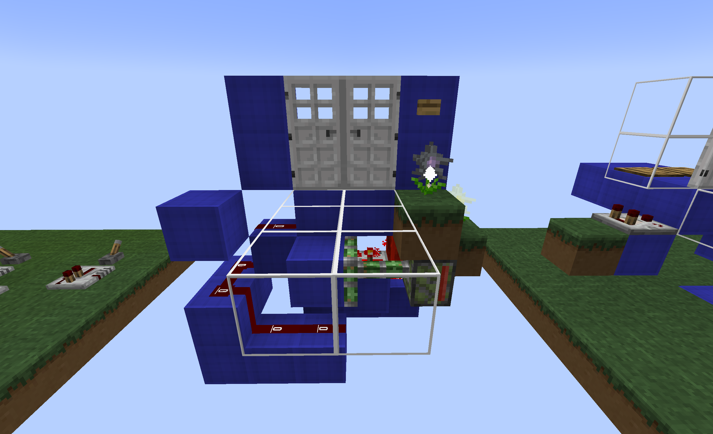
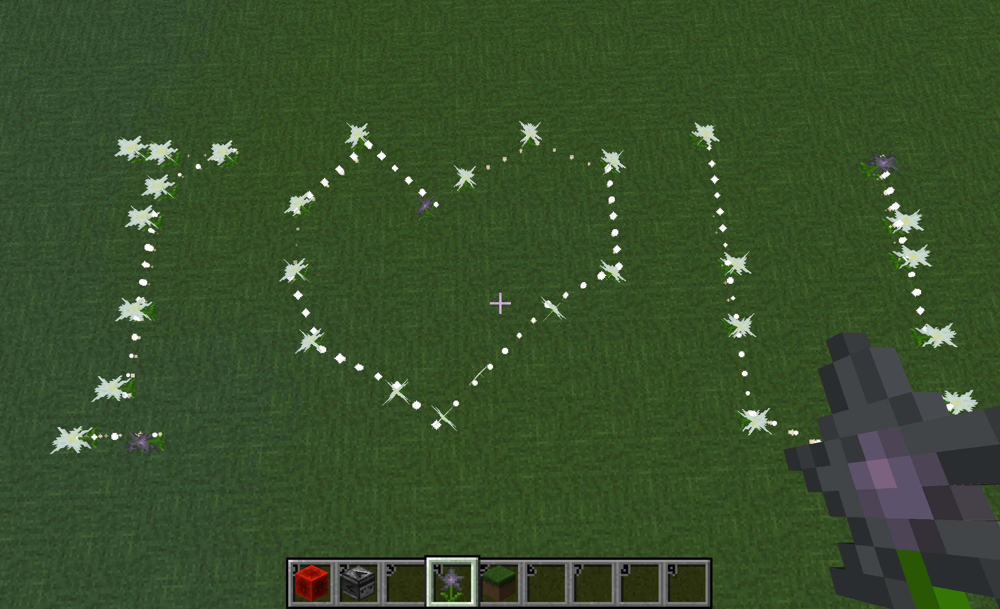

# 链表花

<div align=center></div>

​     

| 添加此物品的原因 | 我的世界红石传输卡顿，减少高频红石的使用 |
| :--------------- | :--------------------------------------- |
| 稀有度           | 常见                                     |
| 命名空间         | comfysky:linked_flower                   |
| 添加版本         | 17.1.16                                  |

​     

## 获取

花种子有概率种出链表花

​     

## 用途

### 接收红石信号

链表花头部（part=head, 黑色本体）在接收到红石信号时，会在同一个游戏刻（game tick）内向所有连接的链表花发送的状态更新信号

​     

### 比较器输出

当链表花头部（part=head, 黑色本体）在接收到红石信号时，所有和它相连的链表花会发出1格的比较器输出信号



图示：玩家利用链表花每游戏刻刷新机制制作的0gt无延迟双开门（原版也可以实现，但是需要高频更新方块状态）

​     

### 食用

链表花可以制作谜之炖菜，食用后产生**饥饿**效果，时长4秒

​     

### 盆栽

可以放置在花盆中

​     

### 染料

一个链表花可以合成1个灰色染料

​     

## 交互

### 红石

链表花头部（part=head, 黑色本体）可以接收到红石信号

​     

### 连接

当链表花头部（part=head, 黑色本体）周围8格**欧几里得距离**内放置或自然生长一朵链表花，它在生成时会尝试连接，具体算法如下：

```java
List<BlockPos> blockPosList = findBlocksInEludeRadius(world, pos, 8, this);
int size = blockPosList.size();
//only obtain the closest head node
if (size > 0) {
     BlockPos blockPos1 = blockPosList.get(0);
     BlockState blockState1 = world.getBlockState(blockPos1);
}

//search head node
    public static List<BlockPos> findBlocksInEludeRadius(World world, BlockPos center, int radius, Block targetBlock) {
        List<BlockPos> matches = new ArrayList<>();
        BlockPos.iterate(center.add(-radius, -radius, -radius), center.add(radius, radius, radius)).forEach(pos -> {
            if (pos.getSquaredDistance(center) <= radius * radius) {
                BlockState state = world.getBlockState(pos);
                if (!pos.equals(center) && state.isOf(targetBlock) && state.get(NODE) == LinkedListNodePart.HEAD) {
                    matches.add(pos.toImmutable());
                }
            }
        });

        //sort all from radius from small to largest
        matches.sort(Comparator.comparingDouble(pos -> pos.getSquaredDistance(center)));
        return matches;
    }
```

​     

### 粒子效果

链表花在连接时会有连接粒子效果



​     

## 数值表

| 常量             | 数据 | 数据类型 |
| :--------------- | ---- | -------- |
| @broke instantly | true | boolean  |

<table border=1> <tr> <th align=left colspan=3> 标签 </th> </tr> <tr> <td align=center rowspan=1 width=120; style="vertical-align:middle"> 方块标签 </td> <td> #minecraft:small_flowers </td> </tr> <tr> <td align=center rowspan=1 width=120; style="vertical-align:middle"> 物品标签 </td> <td> #minecraft:small_flowers </td> </tr> <tr> <td align=center rowspan=2 width=120; style="vertical-align:middle"> NBT标签 </td> <td> NextNodePos </td> </tr> <td> PrevNodePos </td></table>

​     

## 历史

<table border=1 style="width:100% ;height:100%"> <tr> <th align=center colspan=3>Java版</th> </tr> <td align=center rowspan=5 width=120; style="vertical-align:middle">1.20.1</td> <td align=center rowspan=1 width=120; style="vertical-align:middle">17.1.16</td> <td>加入了链表花</td> </tr> </table>


​     

## 你知道吗

链表花的原型是含羞草

​     

## 参考

​     


