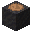
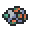
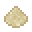
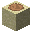
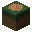

# 挖掘铲

## 求生者挖掘铲

<div align=center></div>

​     

| 添加此物品的原因 | 模组前置                         |
| :--------------- | :------------------------------- |
| 稀有度           | 常见                             |
| 命名空间         | comfysky:survivor_digging_shovel |
| 添加版本         | 17.0.11                          |

​     

## 水元素挖掘铲

<div align=center></div>

​     

| 添加此物品的原因 | 模组前置                        |
| :--------------- | :------------------------------ |
| 稀有度           | 常见                            |
| 命名空间         | comfysky:aquatic_digging_shovel |
| 添加版本         | 17.0.11                         |

​     

## 工程师挖掘铲

<div align=center></div>

​     

| 添加此物品的原因 | 模组前置                         |
| :--------------- | :------------------------------- |
| 稀有度           | 常见                             |
| 命名空间         | comfysky:engineer_digging_shovel |
| 添加版本         | 17.0.12                          |

​     

## 皇家挖掘铲

<div align=center></div>

​     

| 添加此物品的原因 | 模组前置                      |
| :--------------- | :---------------------------- |
| 稀有度           | 稀有                          |
| 命名空间         | comfysky:royal_digging_shovel |
| 添加版本         | 17.0.12                       |

​     

## 大师挖掘铲

<div align=center></div>

​     

| 添加此物品的原因 | 模组前置                       |
| :--------------- | :----------------------------- |
| 稀有度           | 史诗                           |
| 命名空间         | comfysky:master_digging_shovel |
| 添加版本         | 17.0.12                        |

​     

## 获取

### 17.1.1及以下版本

工作台合成

### 17.1.2+

除求生者挖掘铲需要使用工作台合成外，其余等级的挖掘铲需要在锻造台中用对应的锻造升级模板升级

​     

## 用途

不同于Minecraft原版的全新挖掘机制

​     

## 交互

### 挖掘铲作用范围

| 挖掘铲       | 作用范围 |
| ------------ | -------- |
| 求生者挖掘铲 | 1x1      |
| 水元素挖掘铲 | 2x2      |
| 工程师挖掘铲 | 3x3      |
| 皇家挖掘铲   | 4x4      |
| 大师挖掘铲   | 5x5      |

​     

### 挖掘铲修复材料

| 挖掘铲       | 修复材料   |
| ------------ | ---------- |
| 求生者挖掘铲 | 木板*      |
| 水元素挖掘铲 | 海晶沙砾   |
| 工程师挖掘铲 | 铜锭       |
| 皇家挖掘铲   | 下届合金锭 |
| 大师挖掘铲   | 下届之星   |

木板*：任意物品标签为minecraft:planks的物品

​     

### 可挖掘方块

| 可挖掘方块                      | 掉落物                                                       | 挖掘后方块                                                 |
| ------------------------------- | ------------------------------------------------------------ | ---------------------------------------------------------- |
| 雪块（minecraft:snow_block）    | 5%20%1.56%杀手兔 |   |
| 泥巴（minecraft:mud）           | 5%5% |          |
| 沙子（minecraft:sand）          | 5%5% |         |
| 红沙（minecraft:red_sand）      | 5%5% |     |
| 草方块（minecraft:grass_block） | 5%5%5% |  |

​     

## 数值表

| 常量           | 数据 | 数据类型 |
| :------------- | ---- | -------- |
| @MINIMUM_RANGE | 1    | int      |
| @MAXIMUM_RANGE | 5    | int      |

<table border=1> <tr> <th align=left colspan=3> 标签 </th> </tr> <tr> <td align=center rowspan=1 width=120; style="vertical-align:middle"> 物品标签 </td> <td> #treasurehuntlib:digging_shovel </td> </tr> </table>

​            

## 历史

<table border=1 style="width:100% ;height:100%"> <tr> <th align=center colspan=4>Java版</th> </tr> <tr> <td align=center rowspan=11 width=120; style="vertical-align:middle">1.19.2</td> <td width=120;>17.0.1</td> <td>加入了宝藏附魔的木铲</td> </tr> <tr> <td>17.0.2</td> <td>现在宝藏附魔的木铲会生成在李芒果空岛初始岛屿的木桶中</td> </tr> <tr> <td rowspan=2 style="vertical-align:middle">17.0.11</td> <td>移除了宝藏附魔的木铲</td> </tr> <tr> <td>加入了求生者挖掘铲，水铲</td> </tr> <tr> <td rowspan=3 width=120; style="vertical-align:middle">17.0.12</td> <td>修改了求生者挖掘铲，水铲的合成配方和材质</td> </tr> <tr> <td>修改了水铲的挖掘范围由3x3改为2x2</td> </tr> <tr> <td>加入了工程师挖掘铲，黄家挖掘铲，大师铲</td> </tr> <tr> <td width=120;>17.0.13</td> <td>修复了水铲，工程师挖掘铲，黄金铲，大师铲错误修复的材料的BUG</td> </tr> <tr> <td rowspan=3 width=120; style="vertical-align:middle">17.0.15</td> <td>修复了挖掘铲挖掘非可挖掘方块（non-shovelable block）不消耗耐久的BUG</td> </tr> <tr> <td>修复了挖掘铲在玩家视线面对方块侧边无法挖掘方块的BUG</td> </tr> <tr> <td>修复了挖掘铲在玩家视线面对方块侧边不显示方块描边的BUG</td> </tr> <tr> <td align=center rowspan=2 width=120; style="vertical-align:middle">1.19.4</td> <td align=left rowspan=2 width=120; style="vertical-align:middle">17.1.2</td> <td>现在手持挖掘铲在玩家视线指向非宝藏方块时，不再渲染方块轮廓</td> </tr> <tr> <td>修复了手持挖掘铲时渲染错误的视图</td> </tr> </table>

​     

## 你知道吗

1.挖掘铲的原型来自于浮岛物语中的铲子，分别对应了铲子，水铲，游牧铲，皇家铲，机械铲

2.当玩家手持挖掘铲且玩家视线面对雪块或是挖掘过的雪块时，方块描边会变成黑色

3.在17.0.1版本，玩家无法通过合成来获取挖掘铲而是需要输入以下指令来手动生成一把挖掘铲

```
/give @p minecraft:wooden_shovel{Unbreakable:1}
/enchant @p treasurehuntlib:treasure
```

​     

## 参考

​     


