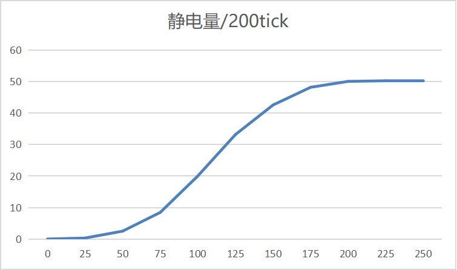

# 静电释放器

​     

| 添加此物品的原因 | Minecraft雷击平均时间约为10小时，雷电不能被存储，减少实体卡顿 |
| :--------------- | :----------------------------------------------------------- |
| 稀有度           | 常见                                                         |
| 命名空间         | comfysky:electrostatic_discharge_rod                         |
| 添加版本         | 17.0.8                                                       |

​     

## 获取

工作台合成

​     

## 用途

当静电摩擦存储满（capacity >= 9999.0)，并且天空光等于15时，**方块上方产生一道雷电**

​     

## 交互

1.雨天不会产生静电摩擦

2.当方块中心 3x1x3 体积内有任意实体时，静电释放器每200tick累加一次静电摩擦，详细计算查看**静电释放器-数值表-静电收集**

3.使用比较器可以检测当前的容量

4.放置在任意方块上

5.铜调试棒右键静电释放器计算以当前产生静电摩擦的速率至存储满所需花费的时间

​     

## 数值表

| 常量              | 数据   | 数据类型 |
| :---------------- | ------ | -------- |
| @MAX_ESD_CAPACITY | 9999.0 | double   |

<table border=1> <tr> <th align=left colspan=3> 标签 </th> </tr> <tr> <td align=center rowspan=2 width=120; style="vertical-align:middle"> 方块标签 </td> <td> #minecraft:mineable/pickaxe </td> </tr> <tr> <td> #need_stone_tool </td> </tr> <tr> <td align=center rowspan=1 width=120; style="vertical-align:middle"> NBT标签 </td> <td> #capacity </td> </tr> </table>

​     

### 静电收集

| 实体数量   | 静电量每200tick计算公式 |
| ---------- | ----------------------- |
| 0-100      | 0.00002*x^3             |
| 100-200    | -0.003*(x-200)^2+50     |
| 200-正无穷 | -(350/x)+51.75          |

[按100实体计算，收集满大约需要83.3分钟，按200实体计算，收集满大约需要33.3分钟]

​     

## 历史

<table border=1 style="width:100% ;height:100%"> <tr> <th align=center colspan=3>Java版</th> </tr> <tr> <td align=center rowspan=2 width=120; style="vertical-align:middle">1.19.2</td> <td width=120;>17.0.8</td> <td>加入了静电释放器</td> </tr> <tr> <td>17.0.9</td> <td>现在静电释放器放置具有方向性</td> </tr> </table>

​     

## 你知道吗

1.静电释放器的原型来自于Minecraft中的避雷针

2.静电释放器在早期开发版中是有被雷击的方块状态的，你可以在assets\comfysky\textures\block中找到一个名叫electrostatic_discharge_rod_on.png的贴图，但是这个贴图从未使用过

3.静电释放器在早期开发版中的名字是电容

​     

## 参考

​     

