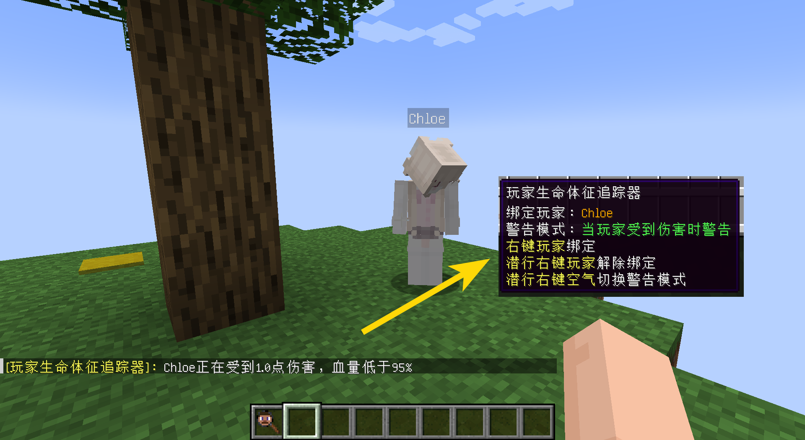

# 玩家生命体征追踪器

​     

| 添加此物品的原因 | 避免假人因为意外死亡                |
| :--------------- | :---------------------------------- |
| 稀有度           | 常见                                |
| 命名空间         | comfysky:player_vital_signs_tracker |
| 添加版本         | 17.1.11                             |

​     

## 获取

工作台合成

​     

## 用途

当绑定该物品的玩家受到伤害时，**背包中含有该物品**的玩家会收到被绑定玩家受到伤害的信息

玩家生命体征追踪器共有**5种警告模式**，分别是：

1.只要玩家受到伤害就会弹出警告

2.玩家剩余血量低于总血量的80%弹出警告

3.玩家剩余血量低于总血量的50%弹出警告

4.玩家剩余血量低于总血量的20%弹出警告

5.完全关闭警告

​      

如图所示绑定玩家受到了1点伤害，那么我们将收到他受到伤害的提示。同样的，如果绑定玩家持续受到伤害，我们也会持续收到提示。如果您想降低灵敏度，我推荐可以设置玩家剩余血量低于总血量的50%时弹出警告。

（游戏初期防止假人饿死比较有效的方法，后期完全可以使用信标来自动回血）

​     

## 交互

1.右键一个你想要绑定的玩家完成绑定

2.潜行右键已经绑定过的玩家以解除绑定

3.潜行右键空气切换当前的警告模式

​     

## 数值表

| 常量       | 数据 | 数据类型 |
| :--------- | ---- | -------- |
| @MAX_COUNT | 1    | int      |

​     

## 历史

<table border=1 style="width:100% ;height:100%"> <tr> <th align=center colspan=3>Java版</th> </tr> <tr> <td align=center rowspan=2 width=120; style="vertical-align:middle">1.20.1</td> <td width=120;>17.1.11</td> <td>加入了玩家生命体征追踪器</td> </tr> <tr> <td>17.1.12</td> <td>现在玩家生命体征追踪器物品文本提示在绑定玩家未在线或不在同一维度时，不再显示警告模式</td> </tr> </table>

​     

## 你知道吗

​     

## 参考

​     

